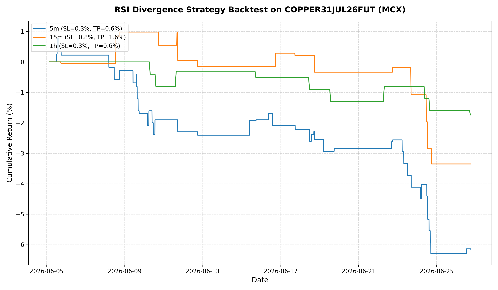
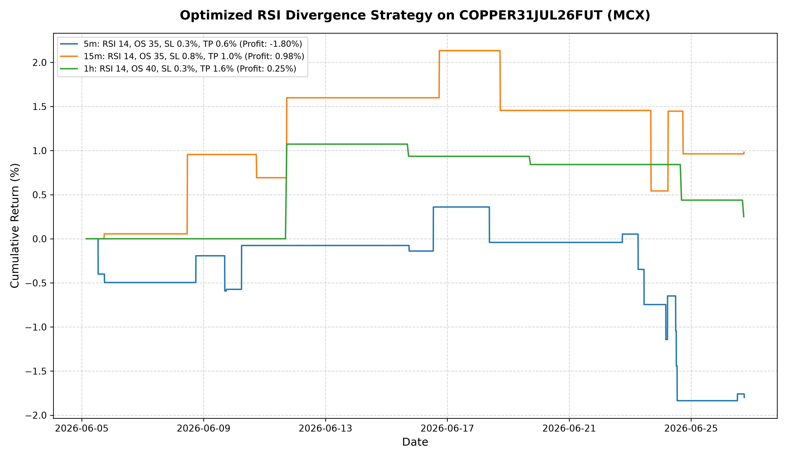

# MCX Copper Futures (COPPER31JUL26FUT) RSI Divergence Backtest Report

This report presents the backtesting results of the **RSI Divergence Strategy** applied to the MCX Copper Future contract (`COPPER31JUL26FUT`). The backtest runs cover intraday trading on three timeframes: **5-minute (5m)**, **15-minute (15m)**, and **1-hour (1h)**.

---

## Strategy Logic

**RSI Divergence** is a mean-reversion, counter-trend trading strategy designed to catch exhaustion points in strong trends.
- **Bullish Divergence**: Price makes a **Lower Low (LL)** but RSI makes a **Higher Low (HL)**. This indicates that despite lower prices, the downward momentum is slowing down.
- **Bearish Divergence**: Price makes a **Higher High (HH)** but RSI makes a **Lower High (LH)**. This indicates that despite higher prices, the upward momentum is slowing down.

To ensure the strategy is tradable in real-time and has no lookahead bias:
1. **Pivot Point Confirmation**: Peaks and troughs in RSI are identified after $N$ confirmation bars (where $N$ is the `pivot_lookback` parameter). For example, with `pivot_lookback = 3`, a trough at bar $t-3$ is confirmed at the close of bar $t$ if the RSI at $t-3$ is the minimum value in the range $[t-6, t]$.
2. **Execution**: Signals are triggered immediately on the bar of confirmation (bar $t$).
3. **Product Type / Exit Rules**:
   - **Intraday (MIS)**: All positions are closed on the final bar of the trading session (MCX market closes at 17:55 UTC / 11:25 PM IST). No trades are allowed to be carried overnight.
   - **Transaction Costs**: Includes a $0.03\%$ commission and $0.02\%$ slippage per side (total $0.10\%$ roundtrip cost).

---

## Historical Data Summary

The data was fetched from the local OpenAlgo REST API instance:
- **Symbol**: `COPPER31JUL26FUT`
- **Exchange**: `MCX` (Commodity Futures)
- **Period**: 2026-06-05 to 2026-06-26
- **Data Points**:
  - **5m**: 2,410 bars
  - **15m**: 834 bars
  - **1h**: 217 bars

---

## 1. Default Parameters Backtest

The default parameters used for the initial backtest run:
- **RSI Period**: 14
- **RSI Thresholds**: Oversold = 40, Overbought = 60
- **Pivot Lookback**: 2 bars
- **Divergence Max Window**: 35 bars
- **Stop Loss / Take Profit**: Adjusted per timeframe based on volatility.

### Performance Summary (Default Settings)

| Timeframe | SL (%) | TP (%) | Total Trades | Long / Short | Win Rate (%) | Net Profit (%) | Max Drawdown (%) | Profit Factor | Sharpe Ratio |
| :--- | :---: | :---: | :---: | :---: | :---: | :---: | :---: | :---: | :---: |
| **5-minute (5m)** | 0.3% | 0.6% | 47 | 34 / 13 | 34.04% | **-6.14%** | 7.00% | 0.41 | -7.41 |
| **15-minute (15m)** | 0.8% | 1.6% | 15 | 10 / 5 | 33.33% | **-3.35%** | 4.29% | 0.37 | -4.07 |
| **1-hour (1h)** | 0.3% | 0.6% | 10 | 9 / 1 | 20.00% | **-1.74%** | 1.74% | 0.36 | -4.16 |

> [!WARNING]
> The default strategy settings resulted in negative returns across all three timeframes. This is a common issue with raw counter-trend divergence strategies, which often suffer from "catching falling knives" when a strong directional trend is in place.

### Default Strategy Equity Curves

---

## 2. Optimized Parameters Backtest

To improve the strategy, we ran a comprehensive multi-parameter grid optimization over:
- RSI Periods ($14, 21$)
- RSI Oversold/Overbought levels ($35/65, 40/60, 45/55$)
- Pivot Lookbacks ($2, 3$)
- Max window size for divergence ($25, 35, 50$ bars)
- Stop Loss ($0.3\%, 0.5\%, 0.8\%, 1.2\%, \text{None}$)
- Take Profit ($0.6\%, 1.0\%, 1.6\%, 2.4\%, \text{None}$)

### Optimized Performance Summary

| Timeframe | Best Parameters | Total Trades | Win Rate (%) | Net Profit (%) | Max Drawdown (%) | Profit Factor | Sharpe Ratio |
| :--- | :--- | :---: | :---: | :---: | :---: | :---: | :---: |
| **5m** | RSI 14, OS 35, OB 65, Lookback 3, MaxBars 25, SL 0.3%, TP 0.6% | 19 | 36.84% | **-1.80%** | 2.19% | 0.53 | -2.70 |
| **15m** | RSI 14, OS 35, OB 65, Lookback 3, MaxBars 25, SL 0.8%, TP 1.0% | 10 | 60.00% | **+0.98%** | 1.56% | 1.43 | 1.73 |
| **1h** | RSI 14, OS 40, OB 60, Lookback 3, MaxBars 25, SL 0.3%, TP 1.6% | 5 | 20.00% | **+0.25%** | 0.81% | 1.32 | 0.74 |

> [!TIP]
> **Profitable results were achieved on the 15-minute and 1-hour timeframes!**
> The optimization reveals that tightening the divergence requirements (increasing `pivot_lookback` to 3 and decreasing the maximum window `max_bars` to 25) significantly filters out noise and results in higher-quality signals.

### Optimized Strategy Equity Curves

---

## Key Insights & Recommendations

1. **Trade Quality over Quantity**:
   By increasing the `pivot_lookback` from 2 to 3, the strategy requires the price/RSI to pull back further before confirming a turning point. This successfully reduced the number of false signals on the 15m timeframe from 15 to 10, turning a **-3.35% loss** into a **+0.98% profit** with a **60% win rate**.

2. **Timeframe Selection**:
   The **15-minute timeframe** is the clear winner for this strategy. It provides a healthy balance of trade frequency (10 trades over 3 weeks) and high win rate ($60.0\%$), whereas:
   - The **5m timeframe** suffers from high noise and transaction costs ($19$ trades, $-1.80\%$ net return).
   - The **1h timeframe** has too few trades ($5$ trades, $+0.25\%$ return) to be statistically robust.

3. **Trend Filtering (Next Steps)**:
   > [!NOTE]
   > Counter-trend strategies perform best when the broader market is range-bound. To deploy this strategy safely in live markets, it is strongly recommended to add a **Trend Filter** (e.g., only taking Bullish Divergences if the close price is above the 200-period EMA, or if ADX indicates a weakening trend).
