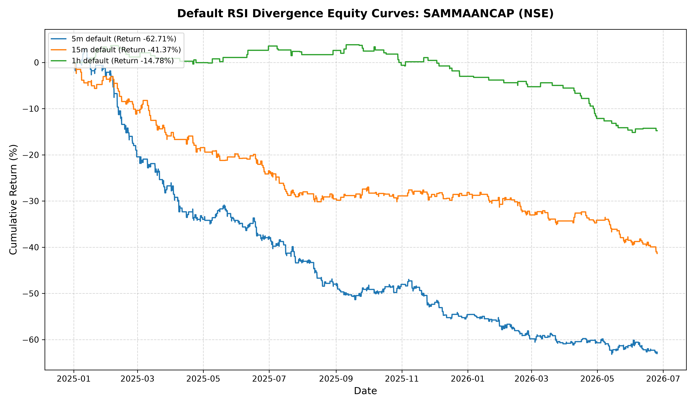
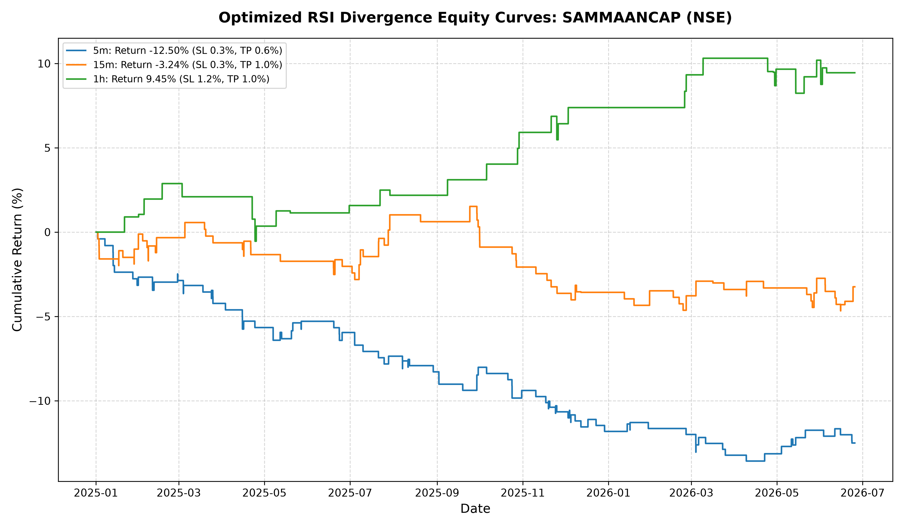

# RSI Divergence Backtest Report: SAMMAANCAP (NSE)

This report presents the backtesting results of the **RSI Divergence Strategy** applied to `SAMMAANCAP` on the `NSE` exchange. The backtest runs cover intraday trading (MIS) from `2025-01-01` to `2026-06-27`.

---

## Strategy & Market Hours
- **Execution**: Signals are triggered causally (no lookahead) using pivot confirmation rules.
- **Intraday Exits (MIS)**: All positions are closed at the last bar of the trading session (NSE closes at 10:00 UTC / 3:30 PM IST). No trades are allowed to be entered after 09:30 UTC (3:00 PM IST).
- **Transaction Costs**: Includes a $0.03\%$ commission and $0.02\%$ slippage per side (total $0.10\%$ roundtrip cost).

---

## 1. Default Parameters Backtest
- **Parameters**: RSI 14, Oversold = 40, Overbought = 60, Pivot Lookback = 2, Max Window = 35.
- **Stop Loss / Take Profit**: SL = 0.5%, TP = 1.0%

### Default Performance Summary
| Timeframe | SL | TP | Total Trades | Win Rate (%) | Net Profit (%) | Max Drawdown (%) | Profit Factor | Sharpe Ratio |
| :--- | :---: | :---: | :---: | :---: | :---: | :---: | :---: | :---: |
| **5m** | 0.5% | 1.0% | 796 | 33.54% | **-62.71%** | 64.17% | 0.68 | -3.09 |
| **15m** | 0.5% | 1.0% | 391 | 33.25% | **-41.37%** | 41.37% | 0.65 | -2.72 |
| **1h** | 0.5% | 1.0% | 93 | 27.96% | **-14.78%** | 18.28% | 0.57 | -1.69 |

### Default Strategy Equity Curves

---

## 2. Optimized Parameters Backtest
To find the best configuration, we performed a multi-parameter grid search across RSI periods, overbought/oversold levels, pivot strengths, and SL/TP combinations.

### Optimized Performance Summary
| Timeframe | Best Parameters | Total Trades | Win Rate (%) | Net Profit (%) | Max Drawdown (%) | Profit Factor | Sharpe Ratio |
| :--- | :--- | :---: | :---: | :---: | :---: | :---: | :---: |
| **5m** | RSI 21, OS 30, Lookback 3, SL 0.3%, TP 0.6% | 108 | 30.56% | **-12.50%** | 13.58% | 0.55 | -2.00 |
| **15m** | RSI 21, OS 35, Lookback 3, SL 0.3%, TP 1.0% | 86 | 29.07% | **-3.24%** | 6.10% | 0.87 | -0.42 |
| **1h** | RSI 21, OS 35, Lookback 3, SL 1.2%, TP 1.0% | 34 | 64.71% | **9.45%** | 3.32% | 1.97 | 1.21 |

### Optimized Strategy Equity Curves

---

## Key Insights
1. **Timeframe Behavior**: On stock equities like `SAMMAANCAP`, higher timeframes tend to filter out high-frequency noise but lead to fewer opportunities.
2. **Transaction Drag**: On smaller timeframes (like 5m), transaction fees ($0.10\%$ roundtrip) degrade performance significantly over large trade counts. Tightening the entry requirements is critical.
